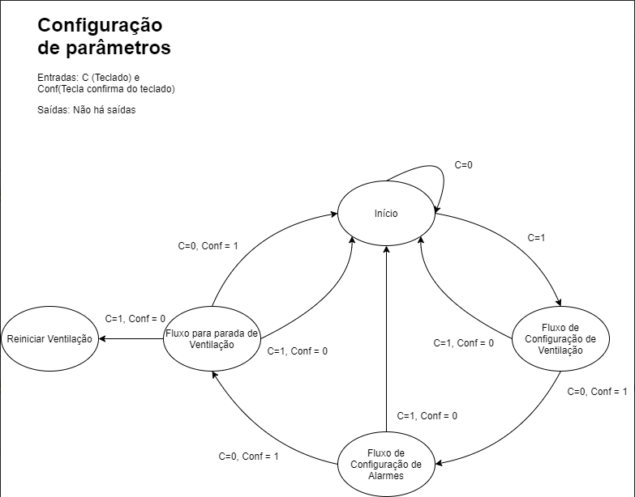
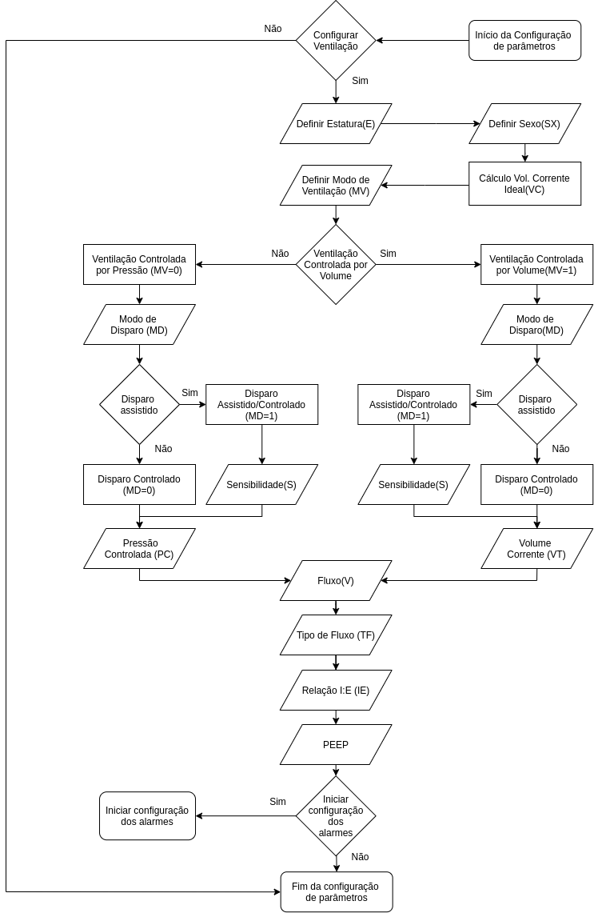
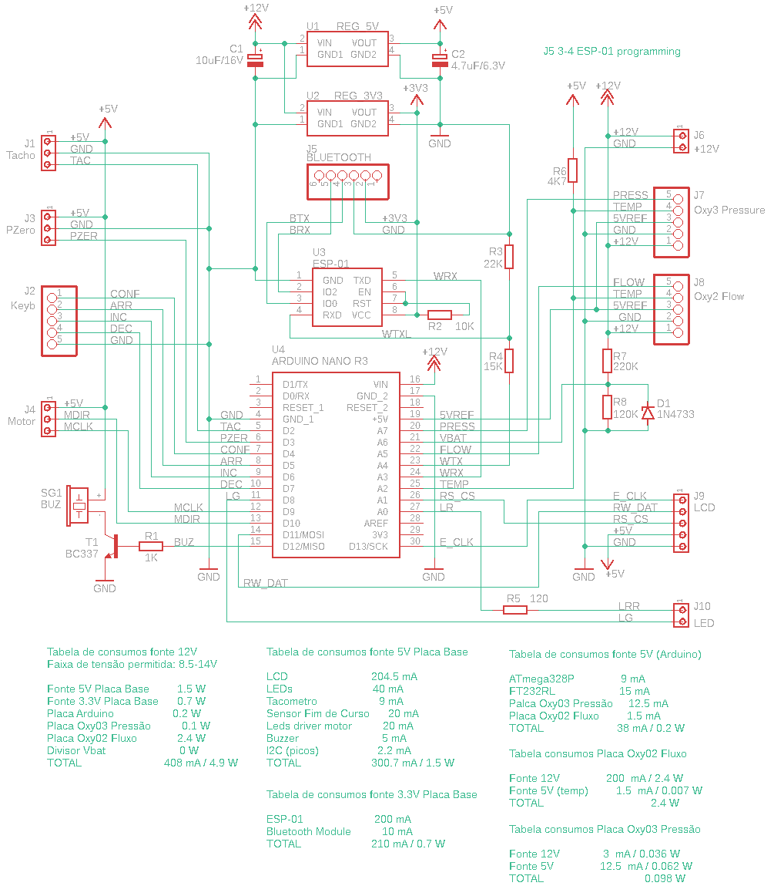

\tableofcontents

\newpage

# Introdução

Esse é o relato de todo o trabalho desenvolvido nos primeiros 2 meses do projeto. Ele segue em consonância ao plano de trabalho desenvolvido para o projeto.

# Objetivos

O projeto tem por objetivo a criação de um protótipo funcional de um ventilador mecânico emergencial, o qual pode ser facilmente transportado, atendendo os pacientes com a urgência.

Na atual situação, onde não há disponibilidade de um ventilador mecânico de UTI que conta com fontes de ar comprimido e de oxigênio, os médicos em situação de urgência são compelidos a utiliza o reanimado manual AMBU (*Artificial Manual Breathing Unit*) para suprir a demanda respiratória necessária ao paciente com as funções respiratórias comprometidas.

Esse trabalho, portanto, toma como alvo tornar o uso do AMBU automático e preciso, sendo ativado através de motores de passo e monitorado através de sensores de fluxo e pressão. O desenvolvimento desse projeto open-source visa a disponibilização de um projeto para que sirva de baluarte para a produção de equpamentos similares, ou que possam ser fabricados segundo os critérios dos órgãos governamentais regulatórios.

# Realização das tarefas

## Primeiro mês

O primeiro mês foi marcado por conhecer o problema e traçar a melhor estrátegia para atacar o problema. Malgrado não termos iniciado o projeto do zero, tendo o professor Daniel numerosos avanços nessa empreitada, é necessário ter-se conhecimento das peculiaridades por detrás de um projeto biomédico.

Nas primeiras semanas, fui o bolsista foi encubido de estudar assiduamente o tema a ponto de levantar discussões pertinentes ao grupo. Marcou-se, dentre as pesquisas, o conhecimento dos modos ventilatórios básicos - assistido - controlado, controlado, controlado por volume, controlado por pressão e etc; o levantamento dos tipos de tratamentos recomendados para o COVID-19 a partir dos documentos da AMIB (Associação de Medicina Intensiva Brasileira); e as particularidades do sistema de controle necessários para atingir o fim proposto. O processo descrito demorou por volta de duas semanas.

Por ser um projeto de estirpe urgente, várias atividades secudárias são executadas em paralelos a fim de aproveitar ao máximo o pouco recurso humano disposto. O aluno, portanto, também ficou responsável por levantar as particularidades dos teclados de membrana, assim como elencar alguns modelos para serem comprados - os quais, em primeiro momento, seriam apenas para a bancada de testes.

Tendo entendido o problema, as últimas semanas foram marcadas pela construção do esqueleto do software. Coube ao aluno criar as máquinas de estados que governariam o processo, a criação dos fluxogramas de trabalho, elencar as váriaveis de interesse e a relação entre elas.

O diagrama mostrado acima é a maquina de estados utilizada para a configuração dos parametros da ventilação e dos alarmes. Esse fluxo pode ser chamado a qualquer momento em que se deseja realizar a modificação de alguma configuração. Esse é um dos diversos diagramas criados que representam as Máquinas de Estados-Finitos (FSM - *Fininte-State Machine*).

Abaixo, tem-se um fluxograma de trabalho para a definição dos parâmetros de ventilação mecânica. Nele encontramos as variáveis básicas a serem definidas, as quais são utilizadas para a definição de outros parâmetros secundários.

\newpage

Esses são exemplos de um sem número de diagramas de governam o esqueleto de software. Eles são adotados em processos que exigem uma cadeia de processos sistemática, com proteção a falhas e com uma boa usabilidade.

Pode-se elencar ainda algumas atividades secundárias, as quais o estudante trabalhou paralelamente durante as duas últimas semanas do primeiro mês: a revisão dos esquemáticos e PCBs do equipamento, a consulta de alguns componentes como o módulo de comunicação Bluetooth e o módulo de comunicação Wi-Fi, além de elencar, em diversos ventiladores mecânicos os principais alarmes e como eles se correlacionam. 

A atividade final do mês foi marcada pela programação do módulo de comunicação Wi-fi. Abaixo, podemos ver o esquemático da placa principal. Ligado ao arduino, onde estará o controle central do equipamento, há um segundo microcontrolador, o ESP-01, que estará responsável por gerenciar a comunicação Wi-Fi e Bluetooth. A ligação entre os microcontroladores e o módulo Bluetooth é feita via interface serial. O bolsista foi encarregado de programar o microcontrolador secundário, ESP-01, para que gerenciasse a troca de dados entre o microcontrolador principal e o módulo Bluetooth, realizando um sistema de ponte, e, simultaneamente, enviar os dados para serem atualizados via Wi-Fi. Também foi programado o sistema que realiza a troca de dados entre o Wi-Fi e o microcontrolador principal.

\newpage

# Resultados

Os resultados obtidos fazem com que o primeiro mês do plano de trabalho seja concluído com sucesso. Todas as etapas foram sistematicamente cumpridas, embora o curto prazo para todas elas. O aluno encontra-se na fase 4 do plano de projeto: desenvolvimento do sistema de alarmes e monitoramento do ventilador mecânico. De fato essa fase está já bastante encaminhada, mas ainda falta a simulação da mesma e o teste em bancada, que deverá ocorrer nas próximas semanas.
